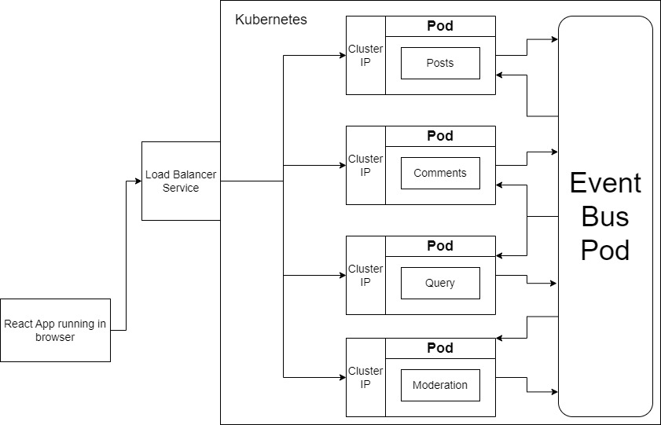

# Microservices Blog Application

This is a microservices-based blog application built with:

- Frontend: React
- Backend Services: Node.js/Express
- Infrastructure: Docker, Kubernetes, Skaffold



## Architecture Overview

The system consists of these core services:

1. **Client** - React frontend application
2. **Posts** - Manages blog posts
3. **Comments** - Handles post comments
4. **Event Bus** - Event-driven communication between services
5. **Moderation** - Filters inappropriate content
6. **Query** - Aggregates data for queries

## Prerequisites

- Node.js v16+
- Docker Desktop
- Kubernetes (Minikube or Docker Desktop Kubernetes)
- kubectl
- Skaffold

## Development Setup

### 1. Install Dependencies

```bash
cd client && npm install
cd ../comments && npm install
# Repeat for other services
```

### 2. Environment Variables

Create `.env` files in each service with required variables.

### 3. Run Services

```bash
# In separate terminals:
cd client && npm start
cd comments && npm start
# Repeat for other services
```

## Kubernetes Deployment

### Deployment Files

- `infra/k8s/client.depl.yaml` - Frontend deployment
- `infra/k8s/comments.depl.yaml` - Comments service
- `infra/k8s/ingress-srv.yaml` - Ingress controller

### Deploy with Skaffold

```bash
skaffold dev
```

## API Documentation

### Posts Service

- `GET /posts` - Get all posts
- `POST /posts` - Create new post

### Comments Service

- `GET /posts/:id/comments` - Get comments for post
- `POST /posts/:id/comments` - Add comment

## Environment Variables

### Client

- `REACT_APP_POSTS_URL` - Posts service endpoint

### Comments

- `MONGO_URI` - MongoDB connection string

## Testing

Run tests for each service:

```bash
cd client && npm test
# Repeat for other services
```

## Troubleshooting

Common issues:

- Kubernetes cluster not running
- Docker not started
- Port conflicts
- Missing environment variables
